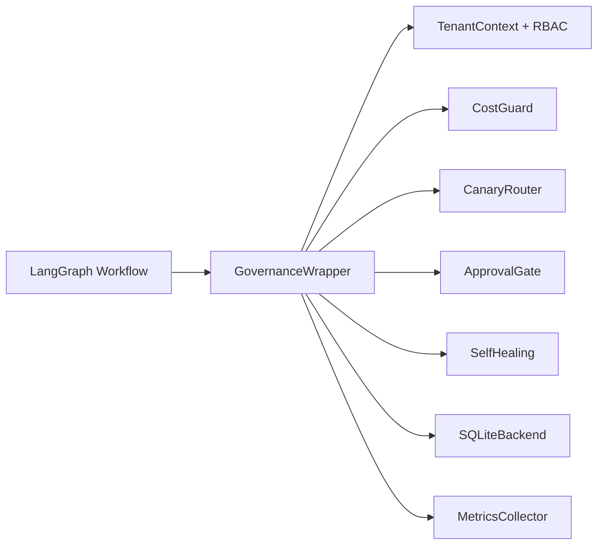

# Maa Protocol

**Maa Protocol is a governance layer for LangGraph workflows.**

It wraps existing LangGraph applications with approval gates, RBAC, tenant isolation, cost controls, canary routing, self-healing, persistence, and observability.

> Status: pre-1.0 governance package. Expanded orchestration experiments live outside the installable governance surface.

---

## What is in scope

- `GovernanceWrapper`
- `ApprovalGate`
- `CostGuard`
- `TenantContext`, `AccessControl`, `TenantGate`
- `CanaryRouter`
- `SelfHealing`
- SQLite-backed approval and audit persistence
- Lightweight governance CLI (`maa-x`)

## What is out of scope

The governance package no longer ships the experimental swarm, RL, browser, routing, plugin, MCP, neural, or marketplace modules from the root `maa_protocol` package. Those experiments remain separated from the focused governance distribution.

---

## Quickstart

```bash
python3 -m venv .venv
source .venv/bin/activate
pip install -e .[dev]
pytest
maa-x version
maa-x governance audit
maa-x swarm init
```

### Minimal example

```python
from maa_protocol import ApprovalGate, CostGuard, GovernanceWrapper, SQLiteBackend, TenantContext

class DemoApp:
    def invoke(self, state, config=None, **kwargs):
        return {"ok": True, "state": state, "config": config or {}}

backend = SQLiteBackend()
app = GovernanceWrapper(
    app=DemoApp(),
    tenant_context=TenantContext(
        tenant_id="tenant-a",
        operator_id="ops-1",
        client_id="client-1",
        user_role="operator",
    ),
    cost_guard=CostGuard(default_budget_usd=100.0),
    approval_gate=ApprovalGate(risk_threshold=0.8, persistence=backend),
    persistence=backend,
)

print(app.invoke({"action": "review"}, config={"user_role": "operator", "cost_usd": 1.25}))
```

---

## Architecture



### Package layout

```text
maa_protocol/
├── __init__.py
├── exceptions.py
├── governance.py
├── cli/
│   └── __init__.py
├── guards/
│   ├── approval.py
│   ├── canary.py
│   ├── cost.py
│   ├── self_healing.py
│   └── tenant.py
├── observability/
│   └── metrics.py
├── persistence/
│   └── base.py
└── utils/
```

---

## Current maturity

Recent reliability work in `v0.3.1` focused on four things:

- governance-only scope alignment
- validated tenant and approval inputs via Pydantic
- CLI stabilization with import-safe governance commands
- broader wrapper, persistence, and CLI test coverage with enforced 80% coverage

The package is now internally consistent with its public positioning: governance first, experiments separated.

---

## Documentation

- [ARCHITECTURE.md](ARCHITECTURE.md)
- [SECURITY.md](SECURITY.md)
- [ROADMAP.md](ROADMAP.md)
- [CONTRIBUTING.md](CONTRIBUTING.md)
- [QUICKSTART.md](QUICKSTART.md)
- [INSTALL.md](INSTALL.md)

## License

MIT
